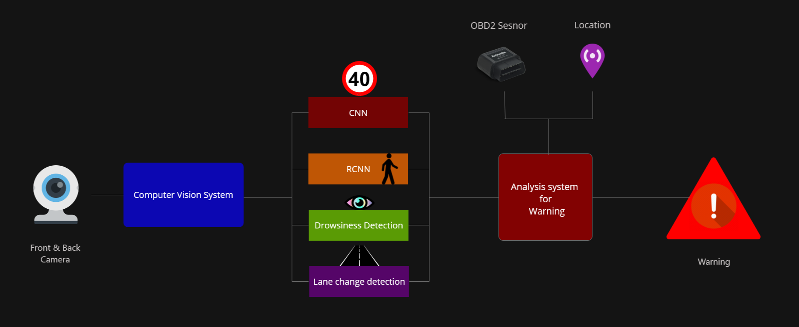
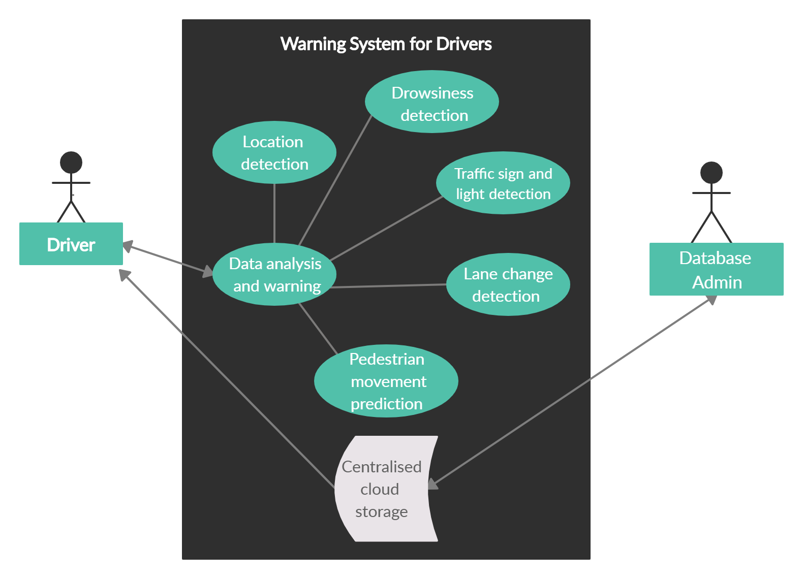

# Drive AI

Drive AI is a complete Warning System for Drivers that uses Artificial Intelligence and Computer Vision.

### Lane Change Detection

* Specifically developed for Indian roads to detect when a vehicle goes out of lane even if lanes are not visible.

## Working and Usecase

### Flowchart

The warning system consists of 3 sub-systems:

* Computer Vision System (Traffic Sign, Signals Detection & Recognition, Pedestrain Movement Prediction, Driver Drowsiness Detection, & Lane Change Detection and Warning)

* Location and Vehicle Data Grabbing System (Location using phone's GPS or using GPRS sensor, Vehicle data such as speed, fuel consumption, etc using OBD2 sensors)

* Data Analysis and Warning System (Analyses the above system's data and decides to give warning to the user if needed).

### Use Case 

The following diagram is the use case diagram of our product:

